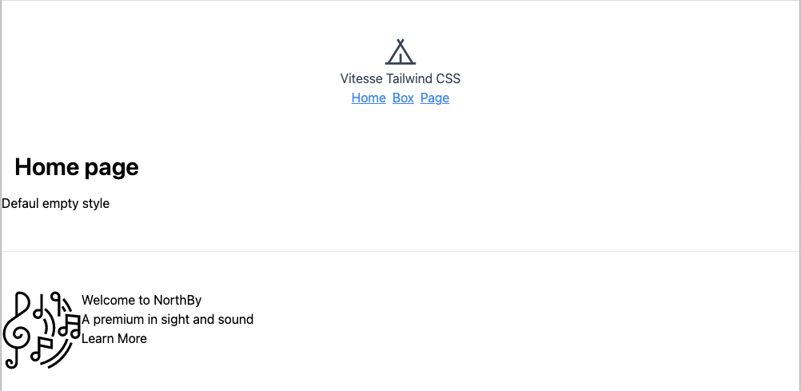

  

<h5 align='center'>
<b>Tailwind version of <a href="https://github.com/antfu/vitesse">Vitesse</a></b>
</h5>

 

## Modern CSS with Tailwind by Noel Rappin

[Book page](https://pragprog.com/titles/tailwind/modern-css-with-tailwind/)

## Features

- ⚡️ [Vue 3](https://github.com/vuejs/vue-next), [Vite 2](https://github.com/vitejs/vite), [pnpm](https://pnpm.js.org/), [ESBuild](https://github.com/evanw/esbuild) - born with fastness

- 🗂 [File based routing](./src/pages)

- 📦 [Components auto importing](./src/components)

- 🎨 [Tailwind CSS 3](https://tailwindcss.com/) - a utility-first CSS framework with on-demand engine.

- 😃 Use icons from any icon sets in [Iconify](https://iconify.design)

- 🔥 Use the [new `<script setup>` style](https://github.com/vuejs/rfcs/pull/227)

- 🦾 TypeScript, of course

 

See [Vitesse](https://github.com/antfu/vitesse) for full featureset.

## Pre-packed

### Plugins

- [Vue Router](https://github.com/vuejs/vue-router)
  - [`vite-plugin-pages`](https://github.com/hannoeru/vite-plugin-pages) - file system based routing
  - [`vite-plugin-vue-layouts`](https://github.com/JohnCampionJr/vite-plugin-vue-layouts) - layouts for pages
- [`unplugin-auto-import`](https://github.com/antfu/unplugin-auto-import) - Directly use Vue Composition API and others without importing
- [`unplugin-vue-components`](https://github.com/antfu/unplugin-vue-components) - components auto import
- [VueUse](https://github.com/antfu/vueuse) - collection of useful composition APIs
